# CodeWords UI Generator - Architecture Summary

A v0-style system where users generate UI via chat, connect to CodeWords workflows, and deploy instantly.

---

## User Journey

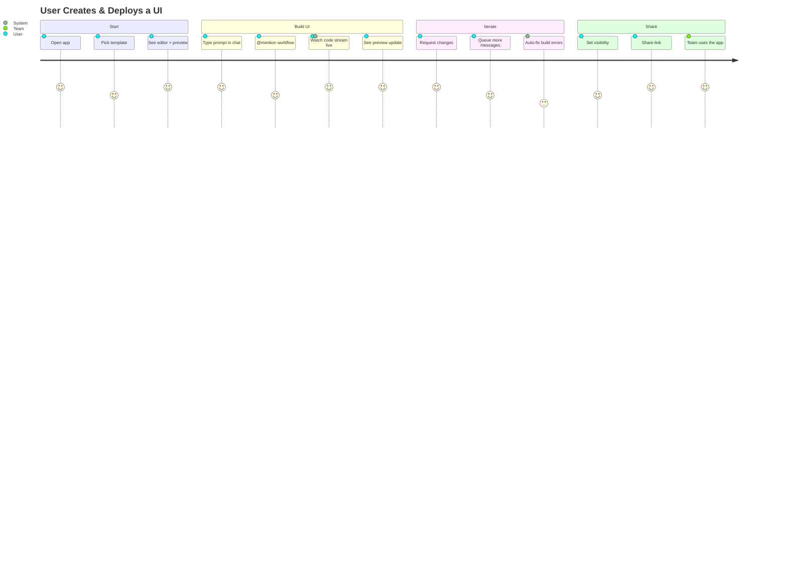

---

## System Architecture

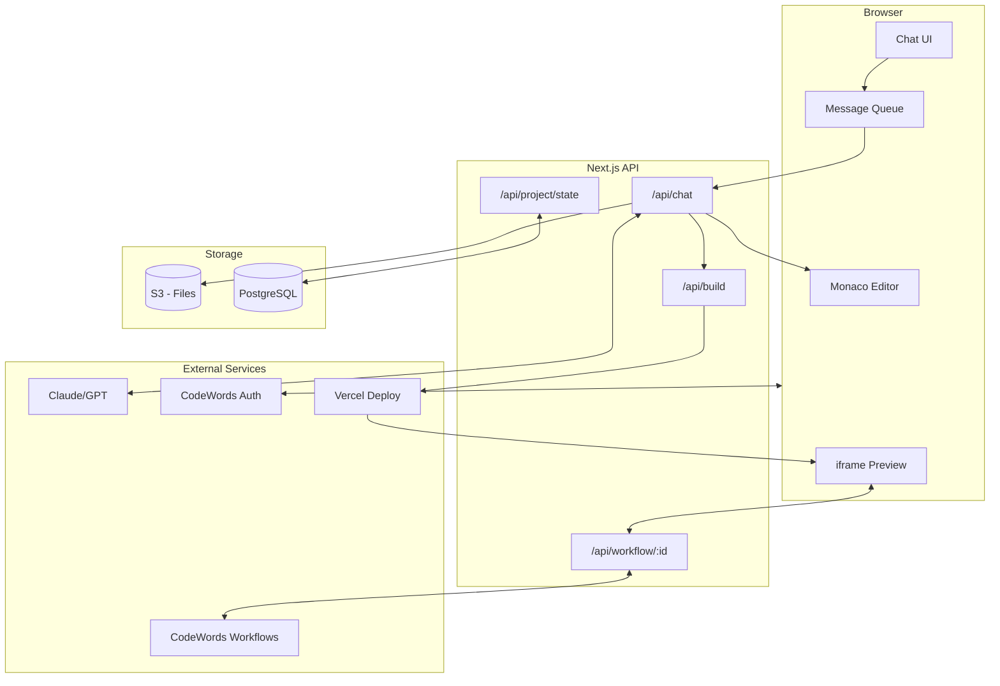

---

## Code Generation Flow

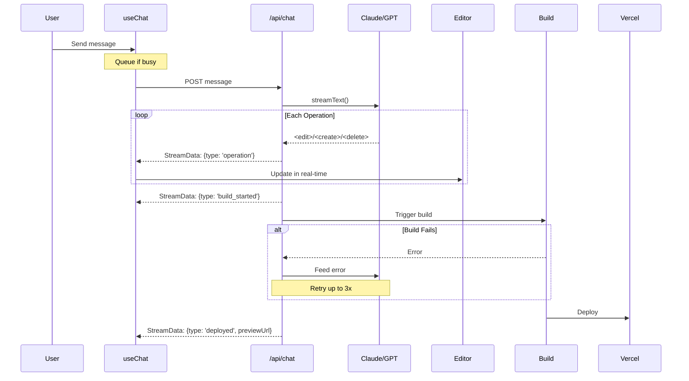

**Streaming via Vercel AI SDK** — `useChat` + `StreamData` sends text and operations in one connection.

### StreamData Events

| Event | When |
|-------|------|
| `{type: 'operation', file, op}` | File created/edited/deleted |
| `{type: 'operation_error'}` | Pattern not found |
| `{type: 'build_started'}` | Build triggered |
| `{type: 'build_failed'}` | Build error |
| `{type: 'deployed', previewUrl}` | Preview ready |

### Client Usage

```tsx
const { messages, data } = useChat({ api: '/api/chat' });

useEffect(() => {
  const latest = data?.[data.length - 1];
  if (latest?.type === 'operation') updateEditor(latest.file);
  if (latest?.type === 'deployed') setPreviewUrl(latest.previewUrl);
}, [data]);
```

---

## LLM Output Format

The LLM outputs **operations**, not full files:

```xml
<!-- Create -->
<create file="src/components/Button.tsx">
export function Button() { ... }
</create>

<!-- Edit (search/replace) -->
<edit file="src/page.tsx">
<search>old code here</search>
<replace>new code here</replace>
</edit>

<!-- Delete -->
<delete file="src/old-file.ts" />
```

**Why?** Smaller payloads, preserves manual edits, precise changes.

---

## Project State Machine

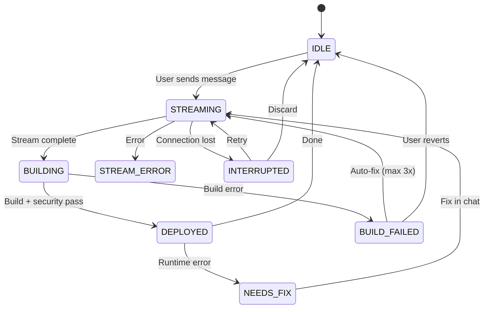

**State persists to DB** — users can recover on next visit.

---

## Build & Security Pipeline

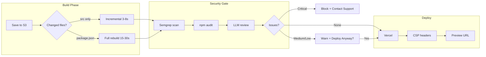

| Severity | Action |
|----------|--------|
| Critical/High | Block deploy |
| Medium/Low | Warn, allow override |

---

## @Workflow Mentions

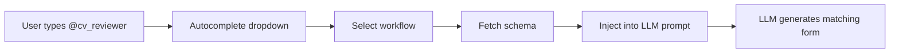

**Schema includes:** inputs (name, type, required), outputs (name, type)

---

## Multi-Workflow & Chaining

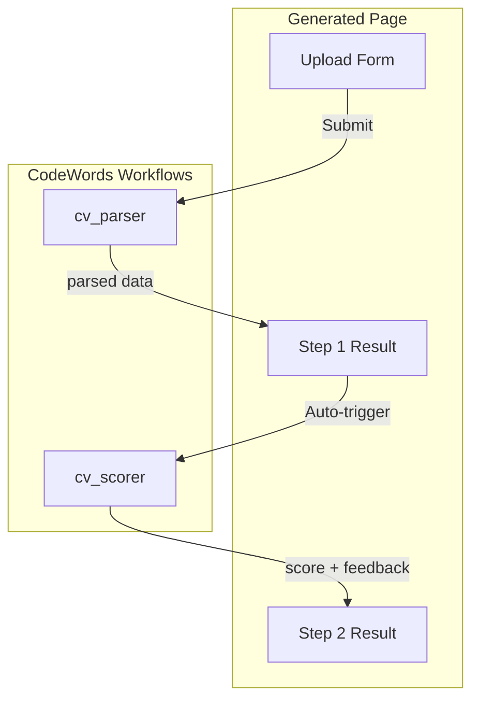

**v1 approach:** UI-layer wizard (state passed between steps in React)

---

## Storage & Versioning

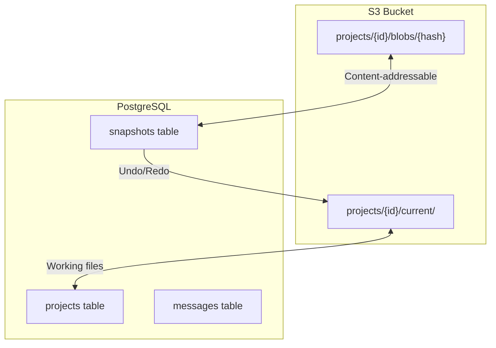

**Content-addressable:** Same content = same hash = deduplicated storage

| Action | What happens |
|--------|--------------|
| Save file | Hash content → store in blobs if new |
| Create snapshot | Record {path → hash} in DB |
| Undo | Restore blobs to current/ |

---

## Database Schema

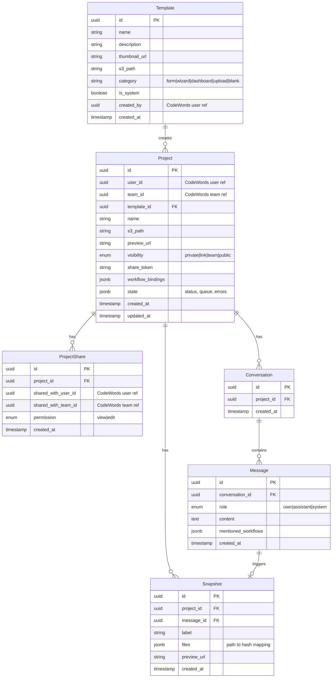

**Notes:**
- `user_id`, `team_id` reference CodeWords entities (not foreign keys)
- `workflow_bindings` stores multi-workflow config with triggers
- `state` stores project state machine for recovery
- `files` in Snapshot maps paths to content-addressable blob hashes

---

## Sharing & Auth

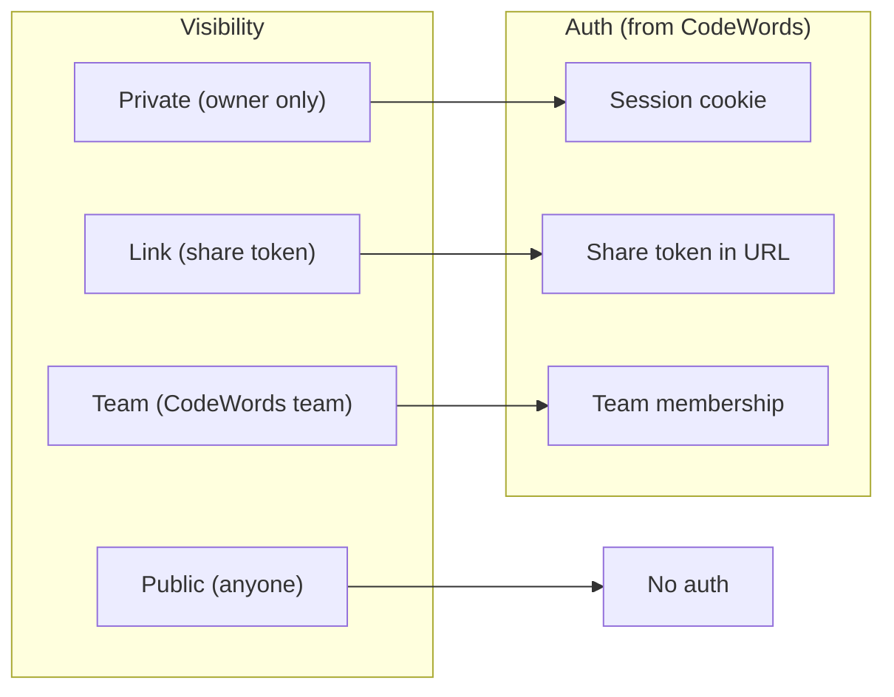

**Auth is NOT duplicated** — reuses CodeWords users, teams, sessions.

---

## Security Layers

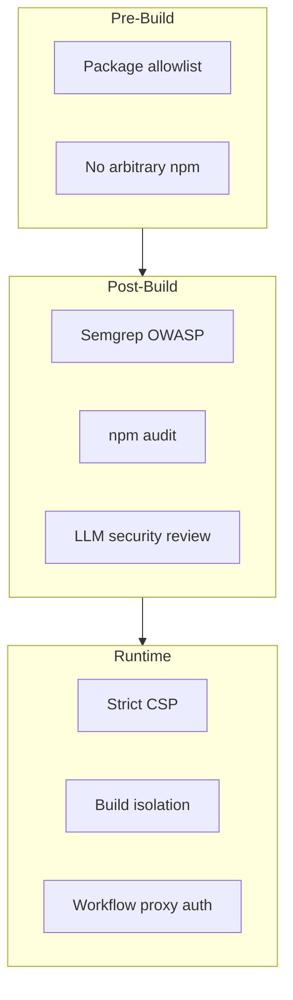

### CSP Policy (on all previews)
```
script-src 'self'
connect-src 'self' https://api.codewords.com
frame-ancestors 'self' https://app.codewords.com
```

### Approved Packages Only
React, Next.js, shadcn/ui, Tailwind, zod, react-hook-form, zustand, date-fns, framer-motion, etc.

**No arbitrary npm packages** — prevents supply chain attacks.

---

## Error Handling

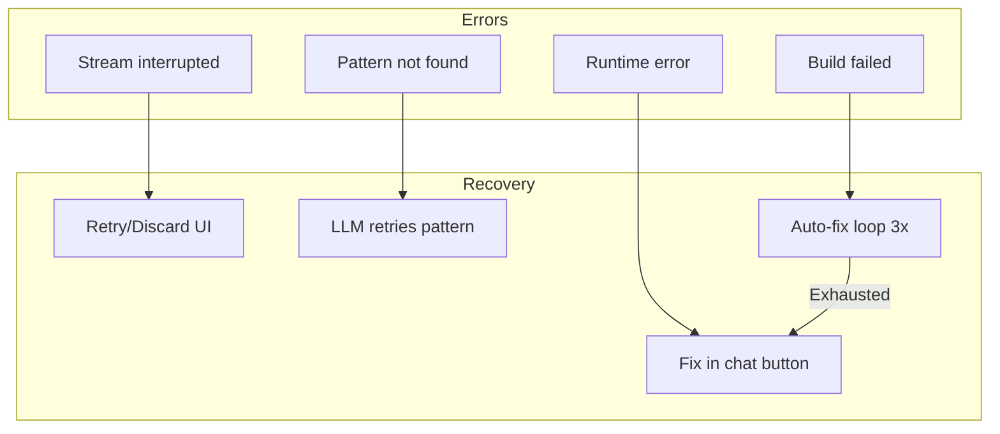

---

## Tech Stack

| Layer | Choice |
|-------|--------|
| Frontend | Next.js 14 (App Router) |
| Styling | Tailwind + shadcn/ui |
| Editor | Monaco |
| Streaming | Vercel AI SDK (`useChat` + `StreamData`) |
| Storage | S3 (files) + PostgreSQL (metadata) |
| Builds | Vercel (incremental via Turbopack) |
| Auth | CodeWords |

---

## Rate Limits

| Resource | Limit |
|----------|-------|
| Builds/project/hour | 20 |
| Chat messages/user/hour | 100 |
| Workflow calls/project/hour | 1000 |
| Deploy Anyway/day | 5 |

---

## Key Metrics

| Metric | Target |
|--------|--------|
| Incremental build | 3-8s |
| Full rebuild | 15-30s |
| Auto-fix retries | 3 max |
| Snapshot retention | 50 per project, 30 days |
