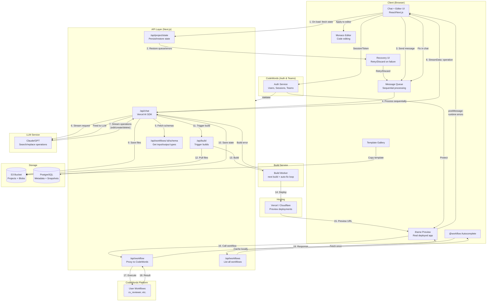
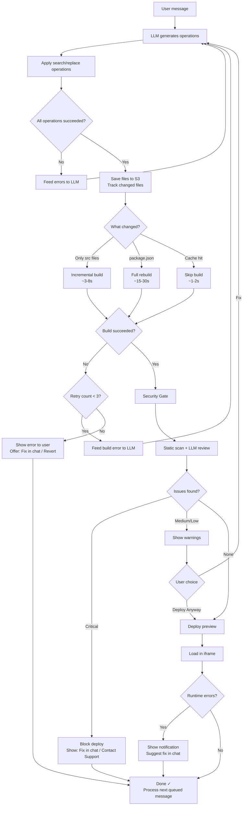
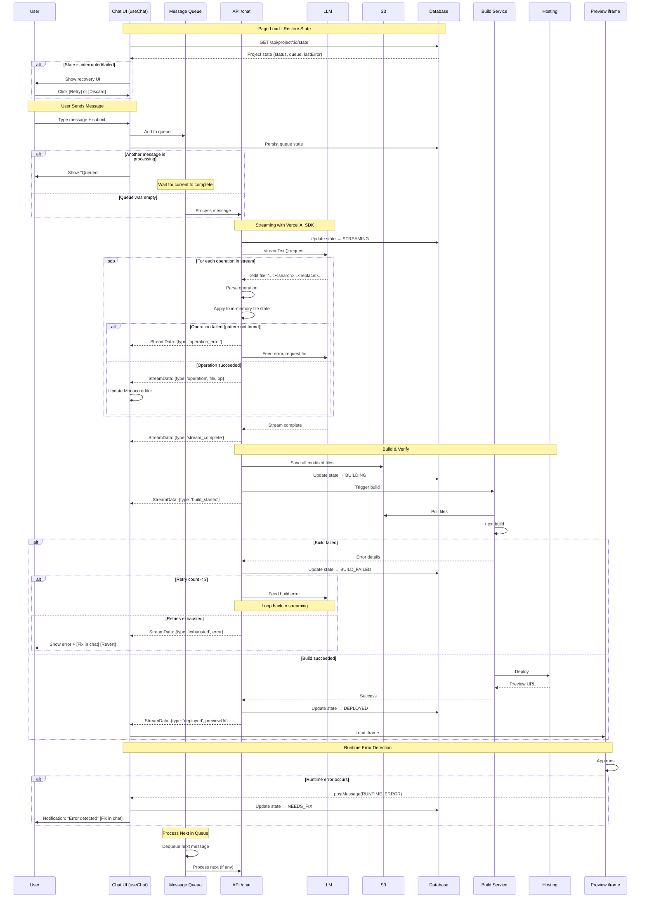
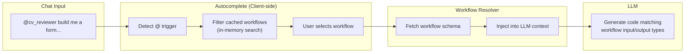
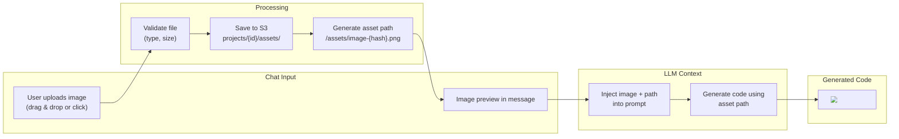
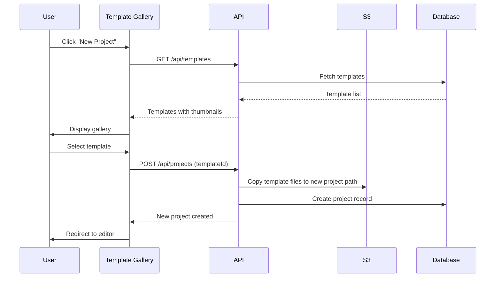
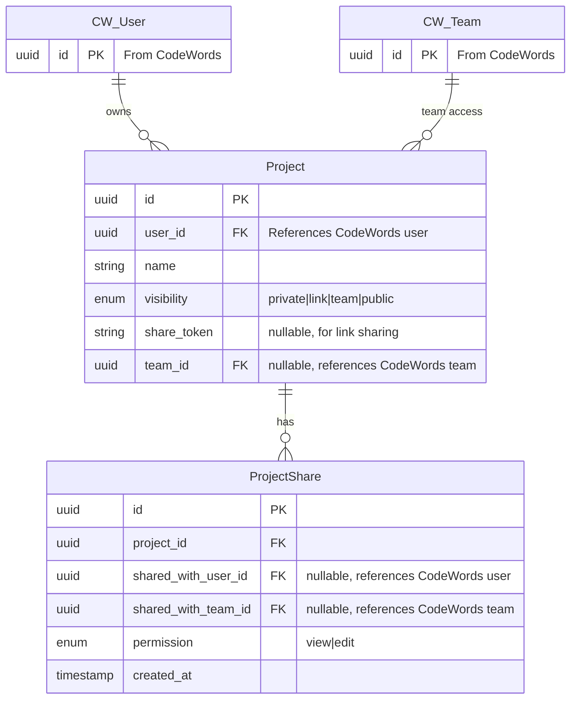
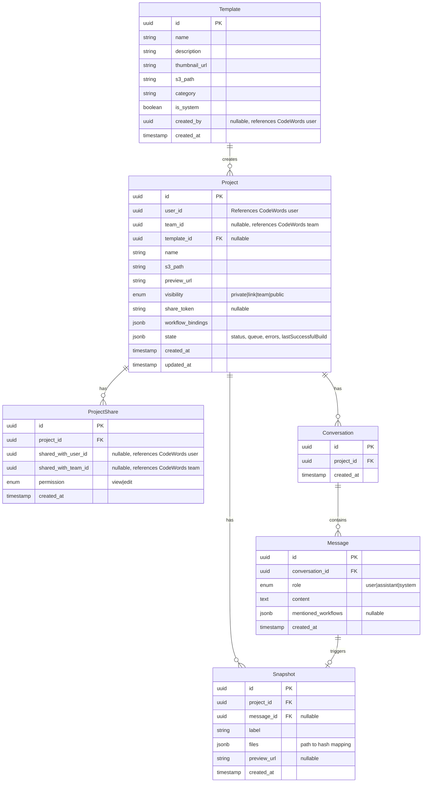
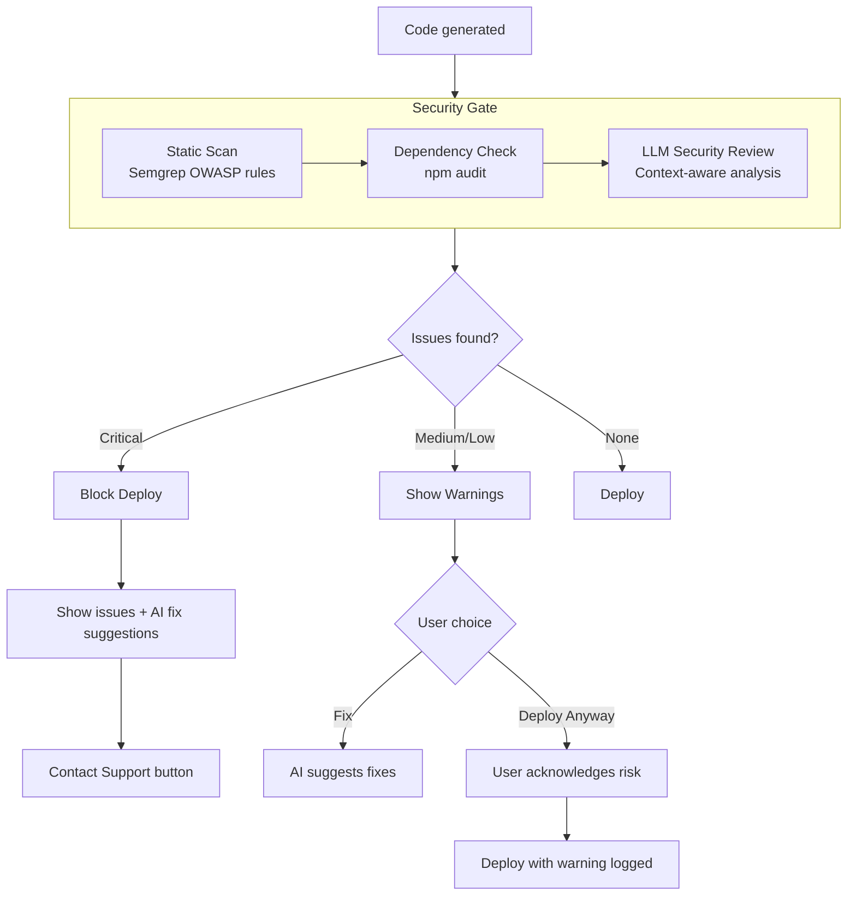

# Architecture Design: v0-style UI Generator for CodeWords

## Overview

This architecture enables users to generate UI forms via natural language chat and connect them to CodeWords workflows. The system streams AI-generated code in real-time, builds it on the backend, and deploys it for instant preview — production-ready from the start.

**Key Design Decisions (from team discussion):**
- Multi-workflow support per page/app
- Private by default, shareable via link or team, with auth protection
- **Auth & teams from CodeWords** — no duplicate user management
- @mention workflows in chat (similar to @files in Cursor)
- Multiple starter templates (not just one)
- Workflow responses are Lambda-style (request → response, no streaming)
- UI-layer wizard for workflow chaining (v1)
- **Search/replace operations** — LLM outputs patches, not full files
- **Message queuing** — Users can type ahead while AI is generating
- **State persistence** — Recovery UI if session was interrupted
- **Build verification** — Every change verified with auto-fix loop (max 3 retries)
- **Security gate before deploy** — Static analysis + LLM security review
- **Critical issues block, warnings allow override** — Balance security with usability
- **CSP on all previews** — Defense in depth against XSS and data exfiltration
- **Incremental builds** — Only rebuild changed files (3-8s vs 15-30s)
- **Content-addressable versioning** — Own snapshot system (not S3 versioning) for undo/redo

---

## Industry Research

How do v0, Lovable, and Bolt.new build their products?

### v0.dev (Vercel)

- **Output**: React components only with shadcn/ui + Tailwind CSS
- **Focus**: Frontend components, not full apps
- **Backend**: Generates API integration code but doesn't run server-side logic
- **Limitation**: Components are standalone — developers handle state management and architecture
- **Strength**: Clean, production-ready code that integrates with existing Next.js projects

Source: [Vercel v0 Review](https://trickle.so/blog/vercel-v0-review), [v0 Docs](https://v0.app/docs)

### Lovable.dev

- **Stack**: React + Vite (frontend), Supabase (backend-as-a-service)
- **LLM**: Claude (Anthropic) with RAG for better context understanding
- **Full-stack**: Auto-provisions database, auth, and storage via Supabase
- **Code ownership**: Generates real, editable code with GitHub integration
- **Origin**: Started as GPT Engineer (open-source CLI tool)

Source: [Lovable Documentation](https://docs.lovable.dev/), [Lovable AI Deep Dive](https://uibakery.io/blog/what-is-lovable-ai)

### Bolt.new (StackBlitz)

- **Core tech**: WebContainers — WebAssembly-based OS running in the browser
- **Performance**: Rust-based filesystem with SharedArrayBuffer for near-native speed
- **npm install**: < 500ms using pre-compressed packages cached on CDN
- **AI control**: Full access to filesystem, terminal, package manager, and browser console
- **Security**: Sandboxed in browser — no access to host machine
- **Open source**: bolt.diy allows choosing your own LLM provider

Source: [How bolt.new works](https://newsletter.posthog.com/p/from-0-to-40m-arr-inside-the-tech), [StackBlitz Infrastructure](https://aitoolsinsights.com/articles/stackblitz-bolt-new-infrastructure-explained), [bolt.new GitHub](https://github.com/stackblitz/bolt.new)

---

## Why Backend Build + Deploy (Not Browser Sandbox)

We chose **backend build + deploy** over browser-based sandboxes (WebContainer, Sandpack) because:

| Aspect | Browser Sandbox | Backend Build + Deploy |
|--------|----------------|------------------------|
| **Preview speed** | Instant (~100ms) | Incremental: 3-8s, Full: 15-30s |
| **Sharing** | Need separate publish step | Ready to share immediately |
| **What users see** | Simulated environment | Real production app |
| **API routes / SSR** | Limited or fake | Works fully |
| **Workflow calls** | Simulated | Real network calls |
| **Mental model** | "Preview vs Published" confusion | What you see = what others see |

**For CodeWords, users want to share real apps with their team** — not sandboxed previews. Backend build ensures production parity from the start.

### Mitigation for slower iteration:
- **Incremental builds** — Since we track which files LLM changed, only rebuild those (3-8s vs 15-30s)
- **Turbopack/SWC** — Rust-based compilation for faster rebuilds
- **Build cache** — Persist node_modules and .next/cache across builds
- **Vercel preview deployments** — Optimized for fast iteration
- **Show "Building..." state** — Keep user informed with progress indicators

---

## Architecture Diagram



---

## Components

### Client Layer

| Component | Technology | Purpose |
|-----------|------------|---------|
| Chat + Editor UI | React/Next.js | Main interface where users type prompts, upload images, and see generated code |
| Message Queue | React state + DB sync | Queues messages during streaming, processes sequentially |
| @workflow Autocomplete | Custom component | Detects `@` in chat, shows searchable workflow list (client-side filter) |
| Template Gallery | React component | Shows available templates when creating new project |
| iframe Preview | Native iframe | Displays real deployed app, reports runtime errors via postMessage |
| Monaco Editor | monaco-editor | VS Code-like editor, updates in real-time as operations stream |
| Recovery UI | React component | Shows on page load if previous session had errors; offers Retry/Discard |

### API Layer

| Endpoint | Purpose |
|----------|---------|
| `/api/chat` | Handles chat messages, streams LLM text + operations via Vercel AI SDK `StreamData` |
| `/api/build` | Triggers build service, handles auto-fix loop, returns preview URL |
| `/api/project/:id/state` | Get/update project state (status, queue, errors) for persistence/recovery |
| `/api/workflow/:id` | Proxy layer that routes requests to CodeWords functions (Lambda-style) |
| `/api/workflows` | Returns all user's workflows (id, name, description) for client-side caching |
| `/api/workflows/:id/schema` | Returns workflow input/output schema for LLM context injection |
| `/api/project/:id/snapshots` | List, create, restore snapshots for undo/redo and version history |

**Note:** Auth handled by CodeWords — all API routes validate session tokens against CodeWords auth service.

### Build Service

- Pulls project files from S3
- **Incremental builds:** Only rebuilds changed files, not entire project
- Runs `next build` or `vite build`
- **Auto-fix loop:** On build failure, feeds error to LLM → applies fix → rebuilds (max 3 retries)
- Deploys to Vercel/Cloudflare Pages
- Returns preview URL (or error details if retries exhausted)

#### Incremental Build Strategy

We use **Turbopack's persistent filesystem cache** for incremental builds. All templates include:

```typescript
// next.config.ts
const nextConfig = {
  experimental: {
    turbopackFileSystemCacheForBuild: true,
  },
}
```

| Scenario | Typical Time |
|----------|--------------|
| First build (cold cache) | 15-30s |
| LLM edits source files (cache hit) | **500ms-3s** |
| LLM adds npm dependency (cache invalidated) | 15-30s |

**How it works:**
- Vercel only uploads changed files (automatic)
- `.next/cache` persisted between deployments (automatic)
- Turbopack recompiles only changed modules (via config above)

### LLM Service

- Uses Claude or GPT for code generation
- **Outputs search/replace operations** (`<edit>`, `<create>`, `<delete>`) instead of full files
- Streams via Vercel AI SDK — operations sent as `StreamData` alongside text
- Receives workflow schemas via @mention for accurate form generation
- Receives build/runtime errors for auto-fix attempts

### Workflow Proxy

The proxy layer (`/api/workflow/:id`) enables runtime binding:
- UI code calls a generic endpoint with workflow ID
- Proxy authenticates and routes to the correct CodeWords function
- **Lambda-style**: Request → Response (no streaming from workflows)
- Handles errors and retries

---

## Streaming Architecture

The streaming system handles real-time code generation, message queuing, state persistence, and automatic error recovery.

### Core Principles

1. **Message queuing** — Users can send messages while streaming; they're queued and processed in order
2. **Search/replace strategy** — LLM outputs patches, not full files, for efficiency and safety
3. **State persistence** — Project state survives interruptions; recovery UI on next visit
4. **Build verification** — Every modification ends with a verified working build
5. **Auto-fix loop** — Build/runtime errors trigger automatic fix attempts
6. **Unified streaming** — Uses Vercel AI SDK's `useChat` with `StreamData` for both text and operations (no separate SSE)

---

### Message Queue System

Users can send messages while the AI is still generating. Messages are queued and processed sequentially.

```typescript
interface MessageQueue {
  processing: QueuedMessage | null;
  pending: QueuedMessage[];
}

interface QueuedMessage {
  id: string;
  content: string;
  mentionedWorkflows: string[];
  status: 'queued' | 'processing' | 'completed' | 'failed';
  createdAt: Date;
}
```

**UX behavior:**
- Queued messages show in chat with "Queued" badge
- User can cancel/delete queued messages before processing
- Each message sees results of previous messages (sequential execution)
- Show queue position: "Your message will be processed after current generation"

```
┌─────────────────────────────────────────────────────────┐
│  Message Queue                                          │
├─────────────────────────────────────────────────────────┤
│  [Processing] "Add a loading spinner to the form"       │
│  [Queued #1]  "Make the submit button blue"             │
│  [Queued #2]  "Add error handling for failed uploads"   │
└─────────────────────────────────────────────────────────┘
```

---

### Streaming Implementation (Vercel AI SDK)

We use Vercel AI SDK's `useChat` hook with `StreamData` to stream both the LLM response and file operations in a single connection.

#### Server: `/api/chat/route.ts`

```typescript
import { streamText, StreamData } from 'ai';
import { anthropic } from '@ai-sdk/anthropic';

export async function POST(req: Request) {
  const { messages, projectId, mentionedWorkflows } = await req.json();
  const data = new StreamData();

  // Track operations for batch save after stream completes
  const operations: FileOperation[] = [];

  const result = streamText({
    model: anthropic('claude-sonnet-4-20250514'),
    system: buildSystemPrompt(mentionedWorkflows),
    messages,

    onChunk({ chunk }) {
      // Parse operations from streamed text
      const parsed = parseOperations(chunk.text);
      for (const op of parsed) {
        const applied = applyToMemory(op);
        if (applied.success) {
          operations.push(op);
          data.append({ type: 'operation', file: op.file, operation: op.type });
        } else {
          data.append({ type: 'operation_error', file: op.file, error: applied.error });
        }
      }
    },

    async onFinish() {
      // Save all operations to S3
      await saveToS3(projectId, operations);
      data.append({ type: 'stream_complete' });

      // Trigger build
      data.append({ type: 'build_started' });
      const buildResult = await triggerBuild(projectId);

      if (buildResult.success) {
        data.append({ type: 'deployed', previewUrl: buildResult.previewUrl });
      } else {
        data.append({ type: 'build_failed', error: buildResult.error, attempt: 1, maxAttempts: 3 });
      }

      data.close();
    },
  });

  return result.toDataStreamResponse({ data });
}
```

#### Client: React Component

```typescript
import { useChat } from 'ai/react';
import { useEffect } from 'react';

export function ChatEditor() {
  const { messages, input, handleSubmit, data, isLoading } = useChat({
    api: '/api/chat',
    body: { projectId, mentionedWorkflows },
  });

  // React to StreamData events
  useEffect(() => {
    if (!data?.length) return;
    const latest = data[data.length - 1];

    switch (latest.type) {
      case 'operation':
        // Update Monaco editor with new file content
        updateEditor(latest.file, latest.operation);
        break;
      case 'operation_error':
        showNotification(`Failed to apply: ${latest.error}`);
        break;
      case 'build_started':
        setStatus('building');
        break;
      case 'deployed':
        setPreviewUrl(latest.previewUrl);
        setStatus('deployed');
        break;
      case 'build_failed':
        setStatus('failed');
        showError(latest.error);
        break;
    }
  }, [data]);

  return (
    // ... Chat UI + Monaco Editor + Preview iframe
  );
}
```

**Benefits of this approach:**
- Single HTTP connection for everything (no separate SSE)
- Built-in React state management via `useChat`
- Operations appear in real-time as LLM generates them
- Type-safe with TypeScript

---

### Search/Replace Operation Format

LLM outputs structured operations instead of full files. This reduces tokens, preserves manual edits, and enables precise changes.

#### Operation Types

```xml
<!-- Create new file -->
<create file="src/components/Spinner.tsx">
export function Spinner() {
  return (
    <div className="animate-spin h-5 w-5 border-2 border-primary rounded-full border-t-transparent" />
  );
}
</create>

<!-- Edit existing file (search/replace) -->
<edit file="src/components/Form.tsx">
<search>
const handleSubmit = () => {
  console.log('submitted');
}
</search>
<replace>
const handleSubmit = async () => {
  setLoading(true);
  try {
    const result = await callWorkflow('cv_reviewer', formData);
    setResult(result);
  } catch (error) {
    setError(error.message);
  } finally {
    setLoading(false);
  }
}
</replace>
</edit>

<!-- Multiple edits in same file -->
<edit file="src/components/Form.tsx">
<search>
import { Button } from '@/components/ui/button';
</search>
<replace>
import { Button } from '@/components/ui/button';
import { Spinner } from '@/components/Spinner';
</replace>
</edit>

<edit file="src/components/Form.tsx">
<search>
<Button type="submit">Submit</Button>
</search>
<replace>
<Button type="submit" disabled={loading}>
  {loading ? <Spinner /> : 'Submit'}
</Button>
</replace>
</edit>

<!-- Delete file (rare) -->
<delete file="src/utils/deprecated.ts" />
```

#### Operation Schema

```typescript
type FileOperation = CreateOperation | EditOperation | DeleteOperation;

interface CreateOperation {
  type: 'create';
  file: string;
  content: string;
}

interface EditOperation {
  type: 'edit';
  file: string;
  search: string;
  replace: string;
}

interface DeleteOperation {
  type: 'delete';
  file: string;
}
```

#### Search/Replace Failure Handling

| Failure | Cause | Recovery |
|---------|-------|----------|
| Pattern not found | File edited manually or LLM hallucinated | Fail operation, show error, LLM retries with corrected pattern |
| Multiple matches | Pattern too generic | Require unique match; LLM must provide more context |
| Whitespace mismatch | Formatting differs | Normalize whitespace before matching (trim lines, collapse spaces) |

**Strategy:** Fail fast on match errors. Show user what was attempted, let AI self-correct.

```typescript
interface OperationResult {
  operation: FileOperation;
  success: boolean;
  error?: {
    type: 'pattern_not_found' | 'multiple_matches' | 'file_not_found';
    message: string;
    attempted: string;  // The search pattern that failed
  };
}
```

---

### File Persistence Strategy

Two distinct saving behaviors based on source:

#### LLM-Generated Code
- **Save to S3 only after stream completes successfully** — never persist partial or broken code
- Operations are applied to in-memory file state during streaming
- If stream is interrupted or fails, in-memory state is discarded (or held for retry)
- S3 write happens only when all operations in a message are applied successfully
- This prevents corrupted/partial code from reaching storage or triggering broken builds

#### Manual Edits (Monaco Editor)
- **Autosave with debounce** — save 2-3 seconds after last keystroke
- User edits go to S3 immediately (after debounce) without waiting for build
- Manual edits are trusted — user is responsible for their own changes
- Enables "edit and test" workflow without waiting for full AI generation cycle

```typescript
// Simplified persistence logic
interface FilePersistence {
  // LLM-generated changes
  saveLLMChanges(projectId: string, operations: FileOperation[]): Promise<void> {
    // Only called AFTER stream completes successfully
    // All operations already validated and applied to in-memory state
  }

  // Manual editor changes
  saveManualEdit(projectId: string, file: string, content: string): void {
    // Debounced — waits 2-3s after last keystroke
    // Saves immediately without build verification
  }
}
```

| Source | When to Save | Build Required? |
|--------|--------------|-----------------|
| LLM stream | After successful completion | Yes (auto-fix loop) |
| Manual edit | 2-3s debounce after keystroke | Optional (user triggers) |
| Recovery retry | After successful retry | Yes |

---

### Project State Machine

Project state is persisted to database, enabling recovery after interruptions.

```
                         ┌──────────────┐
                         │     IDLE     │
                         └──────┬───────┘
                                │ User sends message
                                ▼
                         ┌──────────────┐
              ┌──────────│  STREAMING   │──────────┐
              │          └──────┬───────┘          │
              │                 │                  │
         Interrupted       Completed            Error
              │                 │                  │
              ▼                 ▼                  ▼
   ┌──────────────────┐  ┌──────────────┐  ┌──────────────┐
   │STREAM_INTERRUPTED│  │   BUILDING   │  │ STREAM_ERROR │
   └────────┬─────────┘  └──────┬───────┘  └──────┬───────┘
            │                   │                 │
            │            ┌──────┴──────┐          │
            │            ▼             ▼          │
            │     ┌────────────┐ ┌────────────┐   │
            │     │BUILD_SUCCESS│ │BUILD_FAILED│   │
            │     └─────┬──────┘ └─────┬──────┘   │
            │           │              │          │
            │           ▼              ▼          │
            │     ┌──────────┐   ┌──────────┐     │
            │     │ DEPLOYED │   │NEEDS_FIX │     │
            │     └──────────┘   └────┬─────┘     │
            │                         │           │
            └─────────────────────────┴───────────┘
                            │
                            ▼
                  Recovery UI on next visit
```

#### Persisted State Schema

```typescript
interface ProjectState {
  status: 'idle' | 'streaming' | 'stream_interrupted' | 'building' |
          'build_failed' | 'build_success' | 'deployed' | 'needs_fix';

  // Error details (when applicable)
  lastError?: {
    type: 'stream_interrupted' | 'build_error' | 'runtime_error';
    message: string;
    details?: string;      // Full error log
    timestamp: Date;
  };

  // For retry/recovery
  pendingOperations?: {
    messageId: string;
    operations: FileOperation[];
    completedCount: number;   // How many succeeded before failure
  };

  // Message queue (persisted)
  messageQueue: QueuedMessage[];

  // Last successful state
  lastSuccessfulBuild?: {
    previewUrl: string;
    timestamp: Date;
    snapshotId: string;      // Reference to snapshot for restore
  };
}
```

#### Recovery UX

When user returns to a project with non-idle state:

| State | Recovery UI |
|-------|-------------|
| `streaming` (stale >2min) | "Generation was interrupted. [Retry] [Discard changes]" |
| `stream_interrupted` | "Your last generation was interrupted. [Retry] [Discard changes]" |
| `stream_error` | "Generation failed: {error}. [Retry] [View details]" |
| `building` (stale >5min) | "Build seems stuck. [Retry build] [View logs]" |
| `build_failed` | "Build failed: {error}. [Fix in chat] [View full log] [Revert to last working]" |
| `needs_fix` | "Runtime error detected. [Fix in chat] [Ignore]" |

**"Fix in chat" action:** Pre-populates chat with error context and triggers AI fix attempt.

---

### Build Verification Loop

Every code modification must result in a verified working build that passes security checks.



#### Auto-Fix UX Feedback

Users see real-time status during the auto-fix loop:

```
┌─────────────────────────────────────────────────────────────┐
│  ⚠️  Build failed, attempting fix (1/3)...                  │
│                                                             │
│  Error: Cannot find module '@/components/Spinner'           │
│                                                             │
│  [View full error]                                          │
└─────────────────────────────────────────────────────────────┘
```

**Status messages shown to user:**

| State | Message |
|-------|---------|
| Build started | `Building project...` |
| Build failed, retry 1 | `Build failed, attempting fix (1/3)...` |
| Build failed, retry 2 | `Build failed, attempting fix (2/3)...` |
| Build failed, retry 3 | `Build failed, attempting fix (3/3)...` |
| All retries exhausted | `Build failed after 3 attempts` + [Fix in chat] [Revert] buttons |
| Fix applied | `Fix applied, rebuilding...` |
| Build succeeded | `Build successful, deploying...` |

```typescript
interface BuildStatus {
  state: 'building' | 'failed' | 'fixing' | 'deploying' | 'deployed' | 'exhausted';
  attempt: number;        // Current attempt (1-3)
  maxAttempts: number;    // Always 3
  error?: {
    summary: string;      // Short error message shown inline
    details: string;      // Full error log (shown on "View full error")
  };
}

// StreamData events sent via Vercel AI SDK
type StreamDataEvent =
  | { type: 'operation'; operation: FileOperation; file: string }
  | { type: 'operation_error'; error: string; file: string }
  | { type: 'build_started' }
  | { type: 'build_failed'; attempt: number; maxAttempts: number; error: string }
  | { type: 'fix_applied'; attempt: number }
  | { type: 'build_succeeded' }
  | { type: 'deploying' }
  | { type: 'deployed'; previewUrl: string }
  | { type: 'exhausted'; error: string };
```

---

#### Auto-Fix Prompt Template

When build fails, error is fed back to LLM:

```
The previous code changes caused a build error.

BUILD ERROR:
{error_type}: {error_message}

File: {file_path}
Line: {line_number}

Relevant code context:
{code_snippet}

Please fix this error by providing corrected <edit> operations.
Common fixes:
- Missing imports
- TypeScript type errors
- Invalid JSX syntax
- Undefined variables

Provide ONLY the operations needed to fix this error:
```

#### Retry Limits

| Phase | Max Retries | On Exhaustion |
|-------|-------------|---------------|
| Operation application | 2 | Show failed pattern, ask user to clarify |
| Build | 3 | Show full error log, offer "Fix in chat" or "Revert" |
| Deploy | 2 | Retry automatically, then show error |

---

### Runtime Error Detection

Preview iframe reports runtime errors to parent for proactive fixing.

#### Error Reporting Setup

Inject error boundary and console interceptor into generated apps:

```typescript
// Injected into preview app's _app.tsx or layout.tsx
if (typeof window !== 'undefined') {
  // Capture unhandled errors
  window.onerror = (message, source, line, col, error) => {
    window.parent.postMessage({
      type: 'RUNTIME_ERROR',
      payload: { message, source, line, col, stack: error?.stack }
    }, '*');
  };

  // Capture unhandled promise rejections
  window.onunhandledrejection = (event) => {
    window.parent.postMessage({
      type: 'RUNTIME_ERROR',
      payload: { message: event.reason?.message, stack: event.reason?.stack }
    }, '*');
  };

  // Intercept console.error
  const originalError = console.error;
  console.error = (...args) => {
    window.parent.postMessage({
      type: 'CONSOLE_ERROR',
      payload: { args: args.map(String) }
    }, '*');
    originalError.apply(console, args);
  };
}
```

#### Parent Handler

```typescript
// In editor UI
useEffect(() => {
  const handler = (event: MessageEvent) => {
    if (event.data.type === 'RUNTIME_ERROR' || event.data.type === 'CONSOLE_ERROR') {
      // Show notification
      showNotification({
        type: 'error',
        title: 'Runtime error detected',
        message: event.data.payload.message,
        action: {
          label: 'Fix in chat',
          onClick: () => triggerAutoFix(event.data.payload)
        }
      });

      // Update project state
      updateProjectState({ status: 'needs_fix', lastError: event.data.payload });
    }
  };

  window.addEventListener('message', handler);
  return () => window.removeEventListener('message', handler);
}, []);
```

---

### Streaming Sequence Diagram (Complete)



---

## @Mention Workflows System

Users can @mention workflows in chat to provide context to the LLM, similar to @files in Cursor.

### Flow



### Implementation

1. **On mount**, client fetches all workflows via `/api/workflows` and caches locally
2. **Chat UI** detects `@` character and triggers autocomplete dropdown
3. **Autocomplete** filters cached workflows client-side (instant, no API call)
4. **User selects** workflow from dropdown, workflow ID is attached to message
5. **On submit**, `/api/chat` receives message + list of mentioned workflow IDs
6. **API fetches** workflow schemas from CodeWords via `/api/workflows/:id/schema`
7. **Schemas injected** into system prompt as structured context
8. **LLM generates** code that matches the workflow's expected inputs/outputs

### Workflow Schema Format

```typescript
interface WorkflowSchema {
  id: string;
  name: string;
  description: string;
  inputs: {
    name: string;
    type: 'string' | 'number' | 'file' | 'boolean' | 'object';
    required: boolean;
    description?: string;
  }[];
  outputs: {
    name: string;
    type: string;
    description?: string;
  }[];
}
```

---

## Image Upload & Asset Management

Users can upload images directly in chat to reference in the generated UI. Uploaded images become project assets.

### Flow



### Implementation

#### Upload Handling

```typescript
interface ChatImageUpload {
  id: string;
  originalName: string;
  mimeType: 'image/png' | 'image/jpeg' | 'image/gif' | 'image/webp' | 'image/svg+xml';
  size: number;           // bytes
  assetPath: string;      // /assets/image-{hash}.{ext}
  s3Key: string;          // projects/{projectId}/assets/image-{hash}.{ext}
  thumbnailUrl: string;   // For chat preview
}

// Validation limits
const IMAGE_LIMITS = {
  maxSize: 5 * 1024 * 1024,  // 5MB
  allowedTypes: ['image/png', 'image/jpeg', 'image/gif', 'image/webp', 'image/svg+xml'],
  maxImagesPerMessage: 5,
};
```

#### Storage Structure

```
S3 Bucket
├── projects/
│   ├── {project_id}/
│   │   ├── src/
│   │   ├── public/
│   │   │   └── assets/           ← Uploaded images stored here
│   │   │       ├── image-a1b2c3.png
│   │   │       ├── image-d4e5f6.jpg
│   │   │       └── logo-uploaded.svg
│   │   ├── package.json
│   │   └── ...
```

Images are saved to `public/assets/` so they're served statically by Next.js at `/assets/*`.

#### LLM Prompt Injection

When user uploads images with their message:

```
User uploaded the following images for use in the UI:

1. /assets/image-a1b2c3.png (hero-background.png, 1920x1080, 245KB)
   [Image content shown to multimodal LLM]

2. /assets/image-d4e5f6.jpg (team-photo.jpg, 800x600, 89KB)
   [Image content shown to multimodal LLM]

Use these exact paths when referencing the images in code.
Example: 

User message: "Use the first image as a hero background and add the team photo below"
```

#### Multimodal LLM Support

For LLMs that support vision (Claude, GPT-4V):
- Image content is passed directly to the LLM
- LLM can understand what's in the image and generate appropriate code
- Can describe images for alt text
- Can match colors/styles from uploaded designs

```typescript
// Message format for multimodal LLM
interface ChatMessage {
  role: 'user' | 'assistant' | 'system';
  content: (TextContent | ImageContent)[];
}

interface ImageContent {
  type: 'image';
  source: {
    type: 'base64';
    media_type: string;
    data: string;  // Base64 encoded image
  };
  assetPath: string;  // Path to use in generated code
}
```

### Use Cases

| Scenario | User Action | Generated Code |
|----------|-------------|----------------|
| Hero image | Upload background image | `<div style={{backgroundImage: "url('/assets/hero-xyz.jpg')"}}` |
| Logo | Upload company logo | `` |
| Product images | Upload multiple product photos | Maps through images in a grid component |
| Design mockup | Upload Figma screenshot | LLM replicates the design using the image as reference |
| Icons | Upload custom icon | `` |

### Security Considerations

| Risk | Mitigation |
|------|------------|
| Malicious SVG (XSS) | Sanitize SVG uploads, remove `<script>` tags and event handlers |
| Exif data leakage | Strip metadata from uploaded images |
| Large files | Enforce 5MB limit, compress if needed |
| Storage abuse | Quota per project (e.g., 50MB total assets) |

---

## Template System

Users can start from multiple templates instead of a blank canvas.

### Template Storage

```sql
CREATE TABLE templates (
    id UUID PRIMARY KEY DEFAULT gen_random_uuid(),
    name TEXT NOT NULL,
    description TEXT,
    thumbnail_url TEXT,
    s3_path TEXT NOT NULL,
    category TEXT NOT NULL,
    is_system BOOLEAN DEFAULT true,
    created_by UUID,  -- References CodeWords user (not a FK)
    created_at TIMESTAMP DEFAULT NOW()
);
```

### Template Categories

| Category | Description | Example |
|----------|-------------|---------|
| `form` | Simple input form | CV reviewer intake |
| `wizard` | Multi-step form | Onboarding flow |
| `dashboard` | Results display | Analytics view |
| `upload` | File upload + processing | Document processor |
| `blank` | Minimal starter | Empty canvas |

### Template Flow



---

## Multi-Workflow Binding

Each project can connect to multiple CodeWords workflows with different triggers.

### Workflow Bindings Schema

```typescript
interface WorkflowBindings {
  workflows: {
    [bindingId: string]: WorkflowBinding;
  };
}

interface WorkflowBinding {
  workflowId: string;                    // CodeWords workflow ID
  workflowName: string;                  // Display name
  trigger: 'form_submit' | 'button_click' | 'on_load' | 'chained';
  inputMapping: {
    [workflowParam: string]: string;     // workflow param → form field or state key
  };
  outputMapping: {
    [uiStateKey: string]: string;        // UI state key → workflow result path
  };
  chainedFrom?: string;                  // bindingId of previous workflow (for chaining)
}
```

### Example: Multi-Workflow Page

```json
{
  "workflows": {
    "binding_1": {
      "workflowId": "cv_parser",
      "workflowName": "CV Parser",
      "trigger": "form_submit",
      "inputMapping": {
        "file": "resumeFile",
        "job_description": "jobDescField"
      },
      "outputMapping": {
        "parsedData": "result.parsed"
      }
    },
    "binding_2": {
      "workflowId": "cv_scorer",
      "workflowName": "CV Scorer",
      "trigger": "chained",
      "chainedFrom": "binding_1",
      "inputMapping": {
        "parsed_cv": "parsedData"
      },
      "outputMapping": {
        "score": "result.score",
        "feedback": "result.feedback"
      }
    }
  }
}
```

---

## Workflow Chaining

When a page needs to chain workflows (step 1 → step 2 → step 3), the output of each workflow feeds into the next.

### Approach: UI-Layer Wizard (v1)

For v1, we handle chaining in the generated UI code using a wizard pattern:

```tsx
// Generated code example
const [step, setStep] = useState(1);
const [step1Result, setStep1Result] = useState(null);
const [step2Result, setStep2Result] = useState(null);

const handleStep1Complete = async (formData) => {
  const result = await callWorkflow('cv_parser', formData);
  setStep1Result(result);
  setStep(2);
};

const handleStep2Complete = async () => {
  // Step 2 uses step 1's result as input
  const result = await callWorkflow('cv_scorer', {
    parsed_cv: step1Result.parsed
  });
  setStep2Result(result);
  setStep(3);
};
```

### Why UI-Layer for v1

| Approach | Pros | Cons |
|----------|------|------|
| **UI-layer wizard** | Visible to user, easy to debug, no CodeWords changes | Logic in generated code |
| **Parent orchestration workflow** | Reusable, testable, single source of truth | Requires workflow composition knowledge |

**Decision**: UI-layer for v1. Power users who need complex orchestration can create a parent workflow in CodeWords.

---

## Sharing & Auth Model

Projects are private by default with granular sharing controls. **Auth and teams are managed by CodeWords** — we reuse the existing infrastructure.

### Visibility Levels

| Level | Who can access | Use case |
|-------|----------------|----------|
| `private` | Only owner | Work in progress |
| `link` | Anyone with `share_token` in URL | Share with external reviewer |
| `team` | Team members (via CodeWords teams) | Internal collaboration |
| `public` | Anyone, discoverable | Published template/demo |

### Database Schema for Sharing



**Note:** `CW_User` and `CW_Team` are not stored in our database — they're references to CodeWords entities. We only store the IDs.

### Auth for Deployed Previews

When a project is not public, the deployed preview needs auth:

| Visibility | Auth Method |
|------------|-------------|
| `private` | CodeWords session cookie |
| `link` | `?token={share_token}` in URL |
| `team` | CodeWords session (team membership validated) |
| `public` | No auth required |

**Implementation:** Proxy auth — route preview requests through our API which validates sessions against CodeWords auth service.

---

## LLM Prompt Engineering

### System Prompt Structure

```
You are a UI code generator for CodeWords. Generate React components using:
- Next.js 14 (App Router)
- Tailwind CSS for styling
- shadcn/ui components (Button, Input, Card, Form, etc.)
- TypeScript

OUTPUT FORMAT:
You MUST output file operations using these XML tags:

1. Create new file:
<create file="path/to/file.tsx">
file content here
</create>

2. Edit existing file (search and replace):
<edit file="path/to/file.tsx">
<search>
exact code to find
</search>
<replace>
new code to replace with
</replace>
</edit>

3. Delete file:
<delete file="path/to/file.tsx" />

IMPORTANT RULES:
1. Use <edit> with search/replace for modifications — do NOT output entire files
2. Search patterns must be unique and exact (include enough context)
3. Generate complete, working code - no placeholders or TODOs
4. Use the workflow schemas provided to create accurate form fields
5. Handle loading and error states
6. Make the UI responsive and accessible

PACKAGE SECURITY (CRITICAL):
- ONLY use packages from the approved allowlist (see below)
- NEVER install or import packages not on the allowlist
- If functionality requires an unapproved package, use an approved alternative or implement it manually
- Approved packages: react, react-dom, next, @radix-ui/*, lucide-react, tailwindcss, tailwind-merge, clsx, class-variance-authority, react-hook-form, @hookform/resolvers, zod, zustand, jotai, @tanstack/react-query, date-fns, lodash-es, uuid, nanoid, framer-motion, react-dropzone
- When in doubt, use native browser APIs (fetch, FormData, etc.) over external packages

WORKFLOW INTEGRATION:
- Call workflows via: await fetch('/api/workflow/{workflowId}', { method: 'POST', body: JSON.stringify(data) })
- Handle the response and display results to the user
- Show loading spinners during workflow execution

{workflow_schemas_section}

{existing_files_context}

{conversation_history}

User request: {user_message}
```

### Workflow Schema Injection

When user @mentions workflows, inject their schemas:

```
AVAILABLE WORKFLOWS:

## cv_reviewer
Description: Reviews a CV against a job description and provides feedback
Inputs:
  - resume_file (file, required): The candidate's resume/CV file
  - job_description (string, required): The job description to match against
Outputs:
  - score (number): Match score from 0-100
  - feedback (string): Detailed feedback on the CV
  - suggestions (string[]): List of improvement suggestions

## sentiment_analyzer
Description: Analyzes text sentiment
Inputs:
  - text (string, required): Text to analyze
Outputs:
  - sentiment (string): positive/negative/neutral
  - confidence (number): Confidence score 0-1
```

### Error Recovery Prompts

When a build fails, include the error in the follow-up:

```
The previous code changes caused a build error.

BUILD ERROR:
{error_type}: {error_message}

File: {file_path}
Line: {line_number}

Relevant code context:
{code_snippet_around_error}

Please fix this error by providing corrected <edit> operations.
Common fixes:
- Missing imports
- TypeScript type errors
- Invalid JSX syntax
- Undefined variables

Provide ONLY the <edit> operations needed to fix this error:
```

When a search pattern fails to match:

```
The following edit operation failed because the search pattern was not found:

File: {file_path}
Search pattern attempted:
{search_pattern}

Current file content (relevant section):
{file_content_snippet}

Please provide a corrected <edit> operation with an exact matching search pattern:
```

### Multi-File Generation Strategy

For complex requests, generate files in order:

1. **Types/interfaces** (`types.ts`) - Define shared types first
2. **API utilities** (`lib/api.ts`) - Workflow calling functions
3. **Components** (`components/*.tsx`) - Reusable UI components
4. **Page** (`app/page.tsx`) - Main page composing components

### Token Management

| Scenario | Strategy |
|----------|----------|
| Small edits | Include full file context |
| New features | Include relevant files only |
| Large apps | Summarize existing code, generate incrementally |
| Build errors | Include error + problematic file only |

### Prompt Examples

**Simple form generation:**
```
User: @cv_reviewer create a form to upload resumes

System context includes cv_reviewer schema
LLM generates: Form with file upload + job description textarea + submit button
```

**Multi-workflow page:**
```
User: @cv_parser @cv_scorer create a wizard that first parses the CV then scores it

System context includes both schemas
LLM generates: Multi-step wizard with state passing between steps
```

**Iteration:**
```
User: Make the submit button blue and add a loading spinner

LLM generates: Updated code with blue button + spinner component
```

---

## Storage Architecture

Project files stored in S3, metadata in PostgreSQL:

```
PostgreSQL                           S3 Bucket
├── projects                         ├── projects/
│   ├── id                           │   ├── {project_id}/
│   ├── user_id                      │   │   ├── src/
│   ├── name                         │   │   ├── package.json
│   ├── visibility ──────────────────│   │   ├── next.config.js
│   ├── share_token                  │   │   └── ...
│   ├── s3_path ────────────────────►│
│   ├── preview_url                  ├── templates/
│   ├── workflow_bindings            │   ├── {template_id}/
│   └── created_at                   │   │   └── ...
│                                    │
├── snapshots                        └── blobs/ (content-addressable)
│   ├── id                               └── {hash}/ (deduplicated)
│   ├── project_id
│   ├── files (jsonb)
│   └── created_at
│
├── templates
│   ├── id
│   ├── name
│   ├── s3_path ────────────────────►
│   └── category
```

### Full Database Schema



**Notes:**
- `user_id`, `team_id`, `shared_with_user_id`, `shared_with_team_id`, `created_by` reference CodeWords entities (not foreign keys in our DB)
- User/Team data fetched from CodeWords API when needed (display names, permissions)

---

## Version Control (Undo/Redo)

We use **content-addressable storage** for versioning instead of S3 versioning. This gives us atomic project-level snapshots, automatic deduplication, and full control over retention.

### Why Not S3 Versioning?

| S3 Versioning | Our Approach |
|---------------|--------------|
| File-level versions (no atomic snapshots) | Project-level snapshots |
| Opaque version IDs | Meaningful snapshot metadata |
| Bucket-wide lifecycle policies | Per-project retention control |
| Every save = new version (expensive) | Deduplicated by content hash |
| Hard to query | Fast DB queries |

### Storage Layout

```
S3 Bucket
└── projects/{project_id}/
    ├── current/                    # Working files (always up to date)
    │   ├── src/
    │   │   └── page.tsx
    │   └── package.json
    │
    └── blobs/                      # Content-addressable (deduplicated)
        ├── a1b2c3d4e5f6.../       # SHA-256 hash of content
        ├── b2c3d4e5f6g7.../
        └── c3d4e5f6g7h8.../
```

### How It Works

1. **Save file** → Hash content (SHA-256) → Store in `blobs/{hash}` if not exists
2. **Create snapshot** → Record `{path → hash}` mapping in database
3. **Restore snapshot** → Copy blobs back to `current/` based on mapping
4. **Deduplication** → Same content = same hash = no duplicate storage

```
Snapshot 1:                      Snapshot 2 (added Spinner):
  page.tsx    → hash: abc123       page.tsx    → hash: xyz789  ← changed
  package.json → hash: def456      Spinner.tsx → hash: qwe321  ← new
                                   package.json → hash: def456  ← same blob!
```

### Database Schema

```sql
CREATE TABLE snapshots (
    id UUID PRIMARY KEY DEFAULT gen_random_uuid(),
    project_id UUID NOT NULL REFERENCES projects(id) ON DELETE CASCADE,
    message_id UUID REFERENCES messages(id),  -- Which chat message triggered this
    label TEXT NOT NULL,                       -- "Added loading spinner"
    files JSONB NOT NULL,                      -- {"path": {"hash": "abc...", "size": 1024}}
    preview_url TEXT,                          -- Deployed preview at this snapshot
    created_at TIMESTAMP DEFAULT NOW()
);

CREATE INDEX idx_snapshots_project ON snapshots(project_id, created_at DESC);
```

### Snapshot Lifecycle

| Event | Action |
|-------|--------|
| Successful build | Create snapshot automatically |
| User clicks "Save checkpoint" | Create named snapshot |
| User clicks "Undo" | Restore previous snapshot |
| Retention limit reached | Delete old snapshots, garbage collect orphan blobs |

### Retention Policy

```typescript
const RETENTION = {
  maxSnapshots: 50,        // Per project
  maxAge: 30,              // Days
  minKeep: 5,              // Always keep at least 5
};
```

### API

```typescript
// Create snapshot (called after successful build)
POST /api/project/:id/snapshots
{ messageId?: string, label: string }

// List snapshots
GET /api/project/:id/snapshots
→ [{ id, label, createdAt, previewUrl }]

// Restore snapshot (undo)
POST /api/project/:id/snapshots/:snapshotId/restore

// Get diff between snapshots
GET /api/project/:id/snapshots/:from/diff/:to
→ [{ path, type: 'added' | 'modified' | 'deleted' }]
```

### UX

```
┌─────────────────────────────────────────────────────────────┐
│  📜 Version History                                    [×]  │
├─────────────────────────────────────────────────────────────┤
│  ● Current                                    Just now      │
│  │                                                          │
│  ○ "Added error handling"                     10:30 AM      │
│  │  [Restore] [Compare]                                     │
│  │                                                          │
│  ○ "Added loading spinner"                    10:25 AM      │
│  │  [Restore] [Compare]                                     │
│  │                                                          │
│  ○ "Initial from template"                    10:00 AM      │
│     [Restore] [Compare]                                     │
└─────────────────────────────────────────────────────────────┘
```

**Keyboard shortcuts:**
- `Cmd+Z` (outside editor): Undo last AI change
- `Cmd+Shift+Z`: Redo
- `Cmd+H`: Open version history

---

## Data Flow

### Initial Load
1. **User opens editor** → Fetch project state from DB → If interrupted/failed, show recovery UI
2. **Fetch workflows** → Client fetches all workflows via `/api/workflows` → Cached locally for instant search
3. **Load project files** → Fetch current files from S3 → Populate Monaco editor

### Code Generation (per message)
4. **User sends prompt** → Message added to queue → If queue empty, process immediately; else show "Queued"
5. **Workflow schemas fetched** → API calls `/api/workflows/:id/schema` for @mentioned workflows
6. **LLM streams operations** → Vercel AI SDK streams `<edit>`, `<create>`, `<delete>` operations via SSE
7. **Operations applied** → Each operation parsed and applied to in-memory file state → Monaco updates in real-time
8. **Operation failure** → If search pattern fails, feed error to LLM → LLM retries with corrected pattern
9. **Stream complete** → All operations applied successfully

### Build & Deploy
10. **Files saved to S3** → Modified files saved with versioning, track which files changed
11. **Incremental build** → Only rebuild changed files (3-8s) or full rebuild if package.json changed (15-30s)
12. **Build failure** → Error fed to LLM → Auto-fix loop (max 3 retries) → Or show error to user
13. **Build success** → Security gate (static scan + LLM security review)
14. **Security check** → Critical issues block deploy (show Contact Support) → Warnings allow "Deploy Anyway"
15. **Deploy** → Deploy to Vercel preview (with CSP headers)

### Preview & Runtime
17. **Preview loads** → iframe loads deployed app (with auth if needed)
18. **Runtime error detection** → iframe reports errors via `postMessage` → Notification shown → [Fix in chat]
19. **User interacts** → Form submissions call `/api/workflow/:id` → Proxy routes to CodeWords

### Queue Processing
20. **Next message** → After successful deploy (or error resolution), process next queued message
21. **State persisted** → Project state saved to DB at each phase transition (for recovery)

---

## Key Technical Decisions

| Decision | Choice | Reasoning |
|----------|--------|-----------|
| Streaming | Vercel AI SDK (`useChat` + `StreamData`) | Single connection for text + operations, built-in React hooks |
| LLM output format | Search/replace operations | Smaller payloads, preserves manual edits, precise changes |
| Message handling | Queue with sequential processing | Users can type ahead, each message sees previous results |
| State persistence | DB-stored project state machine | Recovery after interruptions, resume from any state |
| Build verification | Mandatory after every change | Catch errors early, auto-fix loop |
| Error recovery | Auto-retry (max 3) then user prompt | Balance automation with user control |
| Runtime errors | iframe postMessage to parent | Proactive detection, suggest fixes |
| Preview | Backend build + deploy | Production parity, real sharing, no sandbox issues |
| File storage | S3 (no versioning) | Multi-file apps, CDN-ready |
| Version control | Content-addressable blobs + DB snapshots | Atomic project snapshots, deduplication, full control |
| Metadata | PostgreSQL + Prisma | Reliable, typed queries |
| Workflow binding | Multi-workflow with triggers | Flexible, supports chaining and multiple entry points |
| Workflow responses | Lambda-style (no streaming) | Simpler implementation, workflows return complete results |
| Code editor | Monaco | Industry standard, familiar to developers |
| Component library | shadcn/ui | Copy-paste components, easy for LLM to generate |
| Hosting | Vercel or Cloudflare Pages | Fast builds (~10s), preview URLs built-in |
| Auth | CodeWords auth service | Reuse existing infrastructure, no duplication |
| Sharing | Visibility levels + share tokens | Flexible: private, link, team, public |
| Templates | S3-stored, category-based | Users can start from relevant starting points |
| Chaining | UI-layer wizard (v1) | Simple, visible, no CodeWords changes needed |
| Security scanning | Static (Semgrep) + LLM review | Fast deterministic checks + context-aware analysis |
| Critical security issues | Block deploy + Contact Support | Prevent shipping vulnerable code |
| Non-critical issues | Warn + Deploy Anyway option | Balance security with user autonomy |
| CSP | Strict policy on all previews | Defense in depth, limits damage from XSS |
| Build isolation | Vercel (managed) | No self-hosted container complexity |
| Incremental builds | Track changed files, use Turbopack cache | Reduce build time from 15-30s to 3-8s for typical edits |

---

## Error Handling

### Streaming & Generation Errors

| Failure | Detection | Recovery |
|---------|-----------|----------|
| LLM timeout | SSE connection timeout | Show retry button, preserve prompt, restore last state |
| Stream interrupted | SSE connection closed unexpectedly | Save partial state, show "Interrupted" → [Retry] [Discard] |
| Search pattern not found | Operation application fails | Feed error to LLM, auto-retry with corrected pattern (max 2x) |
| Multiple pattern matches | Ambiguous search | Fail operation, ask LLM for more specific pattern |

### Build Errors

| Failure | Detection | Recovery |
|---------|-----------|----------|
| TypeScript error | Build exit code + stderr | Feed error + context to LLM, auto-fix (max 3x) |
| Missing import | Build error parsing | LLM adds import via `<edit>` operation |
| Syntax error | Build error parsing | Show error location, LLM fixes |
| Build timeout | Build exceeds 60s | Cancel, show error, suggest simplification |
| All retries exhausted | Counter reaches max | Show full log → [Fix in chat] [Revert to last working] |

### Runtime Errors

| Failure | Detection | Recovery |
|---------|-----------|----------|
| Unhandled exception | `window.onerror` → postMessage | Notification + [Fix in chat] button |
| Unhandled rejection | `onunhandledrejection` → postMessage | Notification + [Fix in chat] button |
| Console.error | Intercepted console.error | Notification (less urgent) |
| Workflow call fails | HTTP error from `/api/workflow` | Show error in UI, user can retry action |

### Infrastructure Errors

| Failure | Detection | Recovery |
|---------|-----------|----------|
| Deploy fails | Hosting API error | Auto-retry (2x), then show error |
| S3 save fails | S3 API error | Auto-retry (3x), then show error, keep in-memory state |
| Auth fails | 401 from CodeWords | Redirect to login, preserve return URL + unsaved state |
| @mention no matches | Empty filter results | Show "no workflows found" in dropdown |
| Workflow cache stale | Background refresh | Auto-refresh on window focus, periodic refresh |

### Recovery State Persistence

All error states are persisted to database so users can recover on next visit:

```typescript
// Saved to projects.state column
{
  status: 'build_failed',
  lastError: {
    type: 'build_error',
    message: "Cannot find module '@/components/Spinner'",
    details: "full build log here...",
    timestamp: "2024-01-15T10:30:00Z"
  },
  pendingOperations: {
    messageId: "msg_123",
    operations: [...],
    completedCount: 3
  },
  lastSuccessfulBuild: {
    previewUrl: "https://preview-abc123.vercel.app",
    timestamp: "2024-01-15T10:25:00Z",
    snapshotId: "snap_abc123"
  }
}
```

---

## Lessons from Industry Research

### From v0.dev
- Keep generated code clean and copy-paste ready
- Focus on component quality over app scaffolding
- Use shadcn/ui — LLMs generate it well

### From Lovable
- Pair with a BaaS (Supabase) for instant backend
- RAG improves code generation quality — feed LLM the user's existing code/workflows
- GitHub integration matters for real adoption

### From Bolt.new
- Pre-cache common npm packages for fast installs
- Give AI full environment control (terminal, filesystem) for better debugging
- Use SharedArrayBuffer + WASM for performance-critical parts

---

## Applying to CodeWords

| Learning | How to Apply |
|----------|--------------|
| RAG context | @mention workflows injects schemas into LLM prompt |
| BaaS pattern | CodeWords already provides backend — just need to connect |
| Fast builds | Use Vercel/Cloudflare for ~10s builds, cache dependencies |
| AI debugging | Surface build/workflow errors in chat, let AI suggest fixes |
| GitHub export | Future: Allow exporting generated app to GitHub repo |

---

## Recommended Tech Stack

| Layer | Technology | Why |
|-------|------------|-----|
| Frontend | Next.js 14 (App Router) | SSR, streaming, Vercel integration |
| Styling | Tailwind CSS + shadcn/ui | LLM generates clean code |
| Chat streaming | Vercel AI SDK (`useChat` + `StreamData`) | Text + custom data in single stream |
| Code editor | Monaco | Industry standard |
| File storage | AWS S3 + content-addressable blobs | Multi-file projects, deduplicated snapshots |
| Database | PostgreSQL + Prisma | Reliable, typed queries |
| Build service | Vercel API or Cloudflare Pages | Fast preview deployments |
| Auth | CodeWords auth | Reuse existing users, teams, sessions |
| Workflow proxy | Next.js API routes | Simple, same codebase |

---

---

**Note:** See the comprehensive sequence diagram in the [Streaming Architecture](#streaming-sequence-diagram-complete) section above.

---

## Security Considerations

### Security Verification Gate (Before Deploy)

Every code change passes through a security gate before deployment. This catches vulnerabilities that the generating LLM might introduce.

#### Verification Flow



#### Severity Levels

| Severity | Action | User Options |
|----------|--------|--------------|
| **Critical** | Block deployment | Fix in chat, Contact Support |
| **High** | Block deployment | Fix in chat, Contact Support |
| **Medium** | Warn, allow override | Fix in chat, Deploy Anyway |
| **Low** | Warn, allow override | Fix in chat, Deploy Anyway, Ignore |

#### What We Scan For

**Static Analysis (Semgrep):**
| Vulnerability | Pattern | Severity |
|---------------|---------|----------|
| XSS | `dangerouslySetInnerHTML` with user input | Critical |
| Code injection | `eval()`, `Function()`, `new Function()` | Critical |
| Exposed secrets | API keys, tokens in code | Critical |
| Unsafe redirects | Unvalidated redirect URLs | High |
| Prototype pollution | `__proto__` manipulation | High |
| Insecure randomness | `Math.random()` for security | Medium |

**Dependency Check (npm audit):**
| Severity | Action |
|----------|--------|
| Critical CVE | Block |
| High CVE | Block |
| Medium CVE | Warn |
| Low CVE | Log only |

**LLM Security Review:**
```
Review this React/Next.js code for security vulnerabilities.

Focus on:
1. XSS vulnerabilities (user input rendered unsafely)
2. Data exposure (sensitive data in client-side code)
3. Insecure API calls (credentials in URLs, missing auth)
4. Input validation gaps
5. Unsafe data flow from user input to dangerous sinks

Code to review:
{generated_code}

Respond with JSON:
{
  "issues": [
    {
      "severity": "critical|high|medium|low",
      "type": "xss|injection|exposure|...",
      "file": "path/to/file.tsx",
      "line": 42,
      "description": "User input passed to dangerouslySetInnerHTML",
      "suggestion": "Use a sanitization library like DOMPurify"
    }
  ],
  "safe": false
}
```

#### Security Gate UI

```typescript
interface SecurityScanResult {
  passed: boolean;
  canOverride: boolean;  // false if critical/high issues
  issues: SecurityIssue[];
  scanDuration: number;
}

interface SecurityIssue {
  id: string;
  severity: 'critical' | 'high' | 'medium' | 'low';
  type: string;
  file: string;
  line?: number;
  description: string;
  suggestion: string;
  cwe?: string;  // CWE ID if applicable
}
```

**User sees:**
```
┌─────────────────────────────────────────────────────────────┐
│  ⚠️  Security Issues Found                                  │
├─────────────────────────────────────────────────────────────┤
│                                                             │
│  🔴 CRITICAL: XSS Vulnerability                             │
│     File: src/components/CommentDisplay.tsx:24              │
│     User input rendered with dangerouslySetInnerHTML        │
│     [Fix in Chat]                                           │
│                                                             │
│  🟡 MEDIUM: Insecure Randomness                             │
│     File: src/utils/token.ts:8                              │
│     Math.random() used for token generation                 │
│     [Fix in Chat] [Ignore]                                  │
│                                                             │
├─────────────────────────────────────────────────────────────┤
│  [Contact Support]                    [Cancel]              │
└─────────────────────────────────────────────────────────────┘
```

For non-critical issues:
```
┌─────────────────────────────────────────────────────────────┐
│  ⚠️  Security Warnings                                      │
├─────────────────────────────────────────────────────────────┤
│                                                             │
│  🟡 MEDIUM: Insecure Randomness (1 issue)                   │
│  🟢 LOW: Console.log in production (2 issues)               │
│                                                             │
│  [View Details]                                             │
│                                                             │
├─────────────────────────────────────────────────────────────┤
│  [Fix in Chat]    [Deploy Anyway]              [Cancel]     │
└─────────────────────────────────────────────────────────────┘
```

---

### Content Security Policy (CSP)

CSP is critical for preview deployments because:
1. **Generated code is untrusted** — LLM might produce code that loads external scripts
2. **Previews are shared** — Other users visit these URLs
3. **Defense in depth** — Even if code review misses something, CSP blocks exploitation

#### Why CSP Matters for AI-Generated Code

| Threat | Without CSP | With CSP |
|--------|-------------|----------|
| LLM generates `<script src="evil.com">` | Script executes | Blocked |
| XSS payload in user content | Executes arbitrary JS | Blocked (no inline scripts) |
| Data exfiltration via fetch | Sends data anywhere | Only allowed origins |
| Clickjacking | Page can be embedded | Blocked by frame-ancestors |

#### CSP Configuration for Previews

```typescript
// next.config.js for generated apps (injected by build service)
const securityHeaders = [
  {
    key: 'Content-Security-Policy',
    value: [
      // Only allow scripts from same origin (no external scripts)
      "script-src 'self'",

      // Only allow styles from same origin + inline (Tailwind needs this)
      "style-src 'self' 'unsafe-inline'",

      // Only allow images from same origin + data URIs + specific CDNs
      "img-src 'self' data: https://images.unsplash.com",

      // Only allow fonts from same origin + Google Fonts
      "font-src 'self' https://fonts.gstatic.com",

      // CRITICAL: Only allow API calls to our workflow proxy
      "connect-src 'self' https://api.codewords.com",

      // Prevent embedding in iframes (except our editor)
      "frame-ancestors 'self' https://app.codewords.com",

      // Block all plugins (Flash, etc.)
      "object-src 'none'",

      // Restrict base URI
      "base-uri 'self'",

      // Restrict form submissions
      "form-action 'self' https://api.codewords.com",
    ].join('; ')
  },
  {
    key: 'X-Content-Type-Options',
    value: 'nosniff'
  },
  {
    key: 'X-Frame-Options',
    value: 'SAMEORIGIN'
  },
  {
    key: 'X-XSS-Protection',
    value: '1; mode=block'
  },
  {
    key: 'Referrer-Policy',
    value: 'strict-origin-when-cross-origin'
  }
];
```

#### CSP Violation Reporting

Report CSP violations back to our API for monitoring:

```typescript
// Added to CSP header
"report-uri https://api.codewords.com/api/csp-report"

// Or using Report-To header (newer)
{
  key: 'Report-To',
  value: JSON.stringify({
    group: 'csp-violations',
    max_age: 86400,
    endpoints: [{ url: 'https://api.codewords.com/api/csp-report' }]
  })
}
```

**Why report:** Identifies when LLM generates code that violates CSP, feeding back into prompt improvements.

---

### Package Allowlist (Supply Chain Security)

LLM-generated code can only use **pre-approved npm packages**. This prevents supply chain attacks from malicious or compromised packages.

#### Why This Matters
- npm has ~2 million packages — many are abandoned, vulnerable, or malicious
- LLMs trained on internet data may suggest packages with known vulnerabilities
- Typosquatting attacks use similar names to popular packages (e.g., `lodashs` vs `lodash`)
- A single malicious `postinstall` script can compromise the entire build

#### Approved Package Categories

| Category | Allowed Packages |
|----------|------------------|
| **React/Next.js Core** | `react`, `react-dom`, `next`, `@next/*` |
| **UI Components** | `@radix-ui/*`, `@headlessui/react`, `lucide-react`, `react-icons` |
| **Styling** | `tailwindcss`, `tailwind-merge`, `clsx`, `class-variance-authority` |
| **Forms** | `react-hook-form`, `@hookform/resolvers`, `zod` |
| **State** | `zustand`, `jotai`, `@tanstack/react-query` |
| **Utilities** | `date-fns`, `lodash-es`, `uuid`, `nanoid` |
| **Animation** | `framer-motion`, `@react-spring/web` |
| **File Handling** | `react-dropzone` |
| **shadcn/ui deps** | All shadcn/ui component dependencies |

#### Enforcement

```typescript
const ALLOWED_PACKAGES = new Set([
  // Core
  'react', 'react-dom', 'next',
  // UI
  '@radix-ui/*', 'lucide-react', 'clsx', 'tailwind-merge',
  'class-variance-authority',
  // Forms & Validation
  'react-hook-form', '@hookform/resolvers', 'zod',
  // State
  'zustand', 'jotai', '@tanstack/react-query',
  // Utilities
  'date-fns', 'lodash-es', 'uuid', 'nanoid',
  // Animation
  'framer-motion',
  // File handling
  'react-dropzone',
  // ... full list in config
]);

function validatePackageInstall(packageName: string): boolean {
  // Check exact match
  if (ALLOWED_PACKAGES.has(packageName)) return true;

  // Check scoped package patterns (e.g., @radix-ui/*)
  for (const allowed of ALLOWED_PACKAGES) {
    if (allowed.endsWith('/*')) {
      const scope = allowed.slice(0, -2);
      if (packageName.startsWith(scope + '/')) return true;
    }
  }

  return false;
}
```

#### LLM Instruction (Added to System Prompt)

```
PACKAGE SECURITY:
- You may ONLY use packages from the approved allowlist
- NEVER suggest installing packages not on the allowlist
- If a user requests functionality requiring an unapproved package,
  explain which approved alternatives exist OR say it's not possible
- Do NOT use: eval-based packages, native addons, or packages with
  postinstall scripts
```

#### Handling Requests for Unapproved Packages

| Scenario | Response |
|----------|----------|
| User asks for `moment.js` | Suggest `date-fns` (approved alternative) |
| User asks for `axios` | Use native `fetch` (built-in) |
| User asks for obscure package | Explain it's not on allowlist, offer alternatives or custom implementation |
| No alternative exists | Explain limitation, suggest they implement the feature in a CodeWords workflow |

#### Allowlist Expansion Process

New packages can be added after security review:
1. Check npm audit for known vulnerabilities
2. Review package dependencies (transitive risk)
3. Check maintenance status (last update, maintainer activity)
4. Review install scripts for suspicious behavior
5. Add to allowlist in config (requires code review)

---

### Build Isolation

**We use Vercel for builds**, which provides isolation out of the box:
- Each build runs in an isolated container
- No network egress except to npm registry
- Resource limits (CPU, memory, time)
- No access to other customers' builds

If self-hosting builds in the future, we would need:
| Concern | Mitigation |
|---------|------------|
| Malicious postinstall scripts | Network egress blocked during `npm install` |
| Resource exhaustion | CPU/memory limits, 60s timeout |
| Filesystem access | Isolated container, no host access |
| Secrets leakage | No env vars except explicitly needed |

---

### Generated Code Sandboxing

- Generated apps run on Vercel infrastructure (isolated from our backend)
- Apps can only call our `/api/workflow` endpoint (enforced by CSP)
- Workflow proxy validates project ownership before execution
- No direct database access — all data flows through CodeWords workflows

---

### Authentication Flow

- All auth handled by CodeWords auth service
- Preview URLs include project ID
- Proxy validates CodeWords session token before serving
- Share tokens are cryptographically random (256-bit), long-lived
- Tokens are single-use for sensitive operations

---

### CORS Configuration

```typescript
// Workflow proxy CORS settings
const corsOptions = {
  origin: (origin, callback) => {
    // Allow requests from Vercel preview deployments for this project
    const allowedPattern = /^https:\/\/.*\.vercel\.app$/;
    // Also allow our main app
    const allowedOrigins = ['https://app.codewords.com'];

    if (!origin || allowedPattern.test(origin) || allowedOrigins.includes(origin)) {
      callback(null, true);
    } else {
      callback(new Error('CORS not allowed'));
    }
  },
  credentials: true,
  methods: ['POST', 'OPTIONS'],
  allowedHeaders: ['Content-Type', 'Authorization'],
};
```

---

### Rate Limiting

| Resource | Limit | Reason |
|----------|-------|--------|
| Builds per project/hour | 20 | Prevent build abuse |
| Chat messages per user/hour | 100 | Control LLM costs |
| Workflow calls per project/hour | 1000 | Protect CodeWords functions |
| Security scan retries | 3 | Prevent scan bypass attempts |
| Deploy Anyway (with warnings) | 5/day | Limit risky deployments |

---

### Security Audit Log

All security-relevant events are logged:

```typescript
interface SecurityAuditEvent {
  timestamp: Date;
  projectId: string;
  userId: string;
  eventType:
    | 'security_scan_passed'
    | 'security_scan_failed'
    | 'deploy_blocked'
    | 'deploy_override'      // User clicked "Deploy Anyway"
    | 'csp_violation'
    | 'auth_failure'
    | 'rate_limit_hit';
  details: {
    issues?: SecurityIssue[];
    userAcknowledged?: boolean;
    ipAddress: string;
    userAgent: string;
  };
}
```

---

## Open Questions for Future Iterations

1. **Theming**: How do users customize brand colors/fonts across the app?
2. **Collaboration**: Real-time multiplayer editing (like Figma)?
3. **Analytics**: Track which workflows are called most?
4. **Build optimization**: How to reduce build time below 10s?
5. **Offline editing**: Should we add local-first editing with sync?
6. **Custom domains**: Allow users to deploy to their own domain?
7. **GitHub export**: Export generated code to user's GitHub repo?
8. **Parent workflow orchestration**: Advanced chaining via CodeWords (post-v1)?
